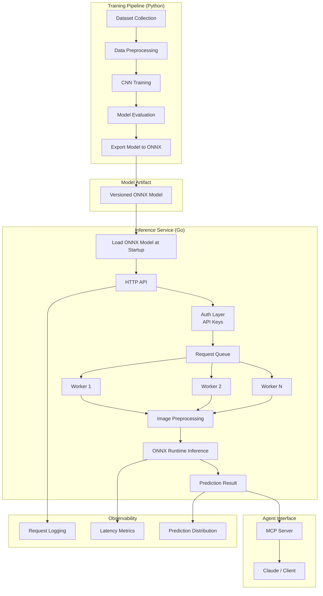

> [If you want to skip reading and want code, here ya go](https://github.com/SuryaKannan/hotdog).

After writing this post, I realised I will never write a book in my life.

I also think my next project needs to be a little bit smaller and better scoped, but here we are.

# Table of Contents

*Part 1: Getting a Machine to learn how to detect hotdogs*

1. [Chapter 1: Hotdog](#chapter-1-hotdog)
2. [Chapter 2: The Dumbest Neural Network Ever](#chapter-2-the-dumbest-neural-network-ever--rocks-are-smarter)
3. [Chapter 3: Why Images Are Hard — It's Just Numbers, Bro](#chapter-3-why-images-are-hard--its-just-numbers-bro)
4. [Chapter 4: Convolutions and CNNs — The Magic Filter](#chapter-4-convolutions-and-cnns--the-magic-filter)
5. [Chapter 5: Building the Dataset — Finding Hotdogs on the Internet](#chapter-5-building-the-dataset--finding-hotdogs-on-the-internet)
6. [Chapter 6: Data Preprocessing — Turning Pixels Into Tensors](#chapter-6-data-preprocessing--turning-pixels-into-tensors)
7. [Chapter 7: Training the First Model — Groundhog Day](#chapter-7-training-the-first-model--groundhog-day)
8. [Chapter 8: Evaluating the Model — Does It Work Though](#chapter-8-evaluating-the-model--does-it-work-though)

*Part 2: An overengineed pipeline, that works*

9. [Chapter 9: Designing the Training Pipeline — Making It Repeatable](#chapter-9-designing-the-training-pipeline--making-it-repeatable)
10. [Chapter 10: Model Artifacts and Versioning — Save Your Work](#chapter-10-model-artifacts-and-versioning--save-your-work)
11. [Chapter 11: Exporting the Model to ONNX — Breaking Up With Python](#chapter-11-exporting-the-model-to-onnx--breaking-up-with-python)

*Part 3: Getting a machine that lives 800km away to actually detect hotdogs*

12. [Chapter 12: Running the Model Outside Python — The Escape](#chapter-12-running-the-model-outside-python--the-escape)
13. [Chapter 13: Why the Inference Service is Written in Go — Why Go](#chapter-13-why-the-inference-service-is-written-in-go--why-go)
14. [Chapter 14: Running ONNX Models in Go — Actually Running It](#chapter-14-running-onnx-models-in-go--actually-running-it)
15. [Chapter 15: Concurrent Inference With Goroutines — Many Hotdogs at Once](#chapter-15-concurrent-inference-with-goroutines--many-hotdogs-at-once)
16. [Chapter 16: Request-Level Logging and Observability — Watching the Watcher](#chapter-16-request-level-logging-and-observability--watching-the-watcher)
17. [Chapter 17: Exposing the Model Through MCP — Claude, Is That a Hotdog?](#chapter-17-exposing-the-model-through-mcp--claude-is-that-a-hotdog)
18. [Chapter 18: Auth and API Keys — No Shirt, No Key, No Service](#chapter-18-auth-and-api-keys--no-shirt-no-key-no-service)

*Part 4: Scaling for my theoretically abundant users*

19. [Chapter 19: Containerization and Deployment — Shipping It](#chapter-19-containerization-and-deployment--shipping-it)
20. [Chapter 20: Monitoring and Metrics — Is It Still Running](#chapter-20-monitoring-and-metrics--is-it-still-running)
21. [Chapter 21: Failure Modes — When It Goes Wrong](#chapter-21-failure-modes--when-it-goes-wrong)
22. [Chapter 22: Lessons Learned — Was It Worth It](#chapter-22-lessons-learned--was-it-worth-it)
23. [Chapter 23: If I Had to Scale This](#chapter-23-if-i-had-to-scale-this)

*Resources*

24. [Everything That Helped Me](#everything-that-helped-me)

---

*Part 1: Getting a Machine to learn how to detect hotdogs*

---

## Chapter 1: Hotdog

I recently re-watched Silicon Valley, an absolutely fantastic show that essentially is a painfully accurate parody of modern day Silicon Valley. Looking back, I think it's become very apparent it's prophetic given our current AI-centric lives.

One scene in particular just flicked a switch in my head and convinced me to start this project. If you don't know what I'm talking about, please stop reading this, go watch all 6 seasons, and come back! 

> OK, if you don't have as much time as I do, [then here is the scene that did it](https://youtu.be/tWwCK95X6go).

So at university, I studied Electrical Engineering (you can guess how great I was at that considering what I do now), and while I did touch on some basics of computer vision, I never really developed the fundamentals that actually would allow me to make something like this from scratch. I also noticed that when you look online, most people don't go all the way with actually deploying an ML model that they made. So I thought, why not do it myself and show how it could be done.

The aim of this project is to create a really over-engineered system that will automatically train and deploy a model that can classify hot-dogs (or not hot-dogs), which I can wrap in an MCP server to run inference with. Hopefully what makes this project more interesting than most others is that it's not just the model that I make, it's the entire end-to-end pipeline. I've tried my best to create relevant sections so that you can jump to whichever one you are interested in, but if you want source code then just jump to the top where I've linked it.

### System Architecture

First I'm just going to present to you the entire system overview, and hopefully as we go through each chapter we'll slowly start building out each of these modules. 

Components to label:

training pipeline (Python, offline)

model artifact (ONNX file, versioned)

inference service (Go, always-on)

MCP layer (bridges Claude to the service)

auth layer (API keys, rotated every 24h)

## Chapter 2: The Dumbest Neural Network Ever — Rocks Are Smarter

Your numpy perceptron.

Explain:

linear classifiers

weights

gradient descent

why this approach fails for images

This chapter shows the learning journey.

## Chapter 3: Why Images Are Hard — It's Just Numbers, Bro

Explain why simple models fail.

Topics:

dimensionality

spatial structure

feature extraction

Lead into CNNs.

## Chapter 4: Convolutions and CNNs — The Magic Filter

Introduce CNN fundamentals.

Explain:

convolution filters

feature maps

edge detection

pooling

Show how CNNs detect patterns in images.

## Chapter 5: Building the Dataset — Finding Hotdogs on the Internet

Discuss the dataset.

Topics:

collecting images

hotdog vs not-hotdog

dataset cleaning

class balance

train / validation / test splits

Explain why data matters more than models.

## Chapter 6: Data Preprocessing — Turning Pixels Into Tensors

You have a folder of images. The model expects a tensor. Those are not the same thing.

Topics:

resizing images to a consistent input dimension (e.g. 224×224)

converting pixel values from uint8 (0–255) to float32 (0.0–1.0)

normalisation — subtracting the channel mean and dividing by standard deviation

why normalisation matters: it keeps activations in a sensible range during training

channel ordering — PyTorch expects CHW (channels, height, width), not HWC

data augmentation — random flips, crops, colour jitter, and why they help generalisation

PyTorch transforms and how they compose into a pipeline

the DataLoader — batching, shuffling, and parallel workers

This chapter is the bridge between "raw files on disk" and "something a neural network can actually consume". It also foreshadows Chapter 14 — when the Go inference service has to do all of this manually, without torchvision.

## Chapter 7: Training the First Model — Groundhog Day

Train your CNN.

Explain:

training loop

mini-batch training

epochs

learning rate

loss functions

Show metrics improving.

## Chapter 8: Evaluating the Model — Does It Work Though

Discuss evaluation.

Topics:

accuracy

validation vs training

overfitting

confusion matrix

Also show failure cases.

### What I Didn't Try: Transfer Learning

The honest answer to "why did you train from scratch?" is: I wanted to understand what the model was actually doing.

Explain what transfer learning is — taking a model already trained on a large dataset (ImageNet, etc.) and fine-tuning it on your task.

Topics:

what a pretrained backbone gives you (learned feature representations)

why it would almost certainly outperform a custom CNN on this dataset

why training from scratch was still the right call for a learning project

what fine-tuning would look like in PyTorch (high level, no code)

This is a good place to be honest with the reader: if you just wanted an accurate hotdog classifier, use a pretrained ResNet and call it a day. That's not what this project is about.

Why CNN instead of MLP?
Why not transfer learning?
How did you avoid overfitting?
How big was the dataset?
Why CNNs for images?
Why not transfer learning?
What dataset size did you need?
How did you evaluate the model?

---

*Part 2: An overengineed pipeline, that works*

---

## Chapter 9: Designing the Training Pipeline — Making It Repeatable

Now shift to systems engineering.

Explain your pipeline:

dataset → training → validation → model artifact

Discuss:

reproducibility

experiment tracking

pipeline automation

## Chapter 10: Model Artifacts and Versioning — Save Your Work

Treat the model as an artifact.

Topics:

model registry

versioned datasets

experiment metadata

Example:

model_v3
trained_on: dataset_v2
accuracy: 0.91

## Chapter 11: Exporting the Model to ONNX — Breaking Up With Python

Explain exporting the model.

Why convert to ONNX:

language independent

portable inference

faster runtime

Explain the training vs inference environment difference.

Why ONNX?
Why Go?
How do you scale inference?
How do you version models?
What happens when the model changes?

---

*Part 3: Getting a machine that lives 800km away to actually detect hotdogs*

---

## Chapter 12: Running the Model Outside Python — The Escape

The model is trained. Now what?

The naive answer is to wrap it in a Flask app and call it a day. Explain why that's not satisfying:

Python is slow to start

High memory overhead

Poor concurrency model for I/O-heavy workloads

Introduce the idea that the model, once exported to ONNX, doesn't need Python anymore. ONNX Runtime has bindings for many languages. This is the moment the project stops being a notebook and starts being a system.

Set up what the rest of this section covers: a Go inference service that loads the ONNX model and serves predictions over HTTP.

## Chapter 13: Why the Inference Service is Written in Go — Why Go

Justify the language choice honestly.

Go's strengths for this use case:

Fast startup — no JVM, no interpreter warmup

Low memory footprint compared to Python runtimes

First-class concurrency with goroutines and channels

Compiles to a single static binary — easy to containerize

What you give up:

No torch ecosystem

Image preprocessing has to be done manually (no torchvision)

Less ML tooling overall

This chapter isn't a language war. It's about matching the tool to the job. The training side stays in Python. The inference side doesn't need to.

## Chapter 14: Running ONNX Models in Go — Actually Running It

Walk through loading and running the model using the ONNX Runtime Go bindings.

Topics:

Importing onnxruntime-go

Loading the model from disk

Understanding input/output tensor shapes

Feeding a preprocessed image as a flat float32 slice

Reading the output logits and converting to a prediction

### Inference Preprocessing in Go

This is where Chapter 6 comes back to bite you. Everything torchvision did for free during training — resizing, normalising, converting to CHW — you now have to do yourself in Go, and you have to do it exactly the same way, or your model will silently produce wrong predictions.

Topics:

decoding the incoming image (JPEG, PNG) into raw pixel data

resizing to the model's expected input dimensions — discuss filter choice (bilinear vs nearest neighbour) and why it matters

channel splitting: Go's image.RGBA is HWC with an alpha channel, the model wants CHW without one

normalising using the same mean and std values used during training — these must be hardcoded or stored alongside the model artifact, not guessed

converting to a flat []float32 in the correct memory layout for the ONNX Runtime input tensor

The key lesson: the preprocessing pipeline is part of the model contract. If the Python training code and the Go inference code disagree on any single step, the model's accuracy degrades silently. This is a good argument for storing the preprocessing parameters (resize dimensions, mean, std) as metadata alongside the ONNX file.

## Chapter 15: Concurrent Inference With Goroutines — Many Hotdogs at Once

ONNX Runtime sessions have thread-safety considerations worth discussing.

Topics:

What "session" means in ONNX Runtime

Whether sessions can be shared across goroutines (yes, with caveats)

A simple worker pool pattern to handle concurrent requests without creating a new session per request

Benchmarking: show latency under load with and without concurrency controls

This chapter is where Go earns its place. Show requests per second, P99 latency, something concrete.

### Benchmark Results

Put real numbers here. Something like:

| Scenario | RPS | P50 latency | P99 latency |
|---|---|---|---|
| Single goroutine | — | — | — |
| Worker pool (N workers) | — | — | — |
| Baseline (Python/Flask) | — | — | — |

Include the test setup: how requests were generated, what hardware you ran on, what image size you used.

Explain what the numbers mean and where the bottleneck actually is (CPU-bound inference, I/O, preprocessing). Don't just report numbers — interpret them.

## Chapter 16: Observability — Logging, Metrics and Tracing

Explain monitoring.

Topics:

training metrics

inference latency

prediction distribution

logging

Explain why ML systems need observability.

## Chapter 17: Exposing the Model Through MCP — Claude, Is That a Hotdog?

Your MCP idea.

Example flow:

Claude → MCP → hotdog classifier

Now the system becomes interactive.

## Chapter 18: Auth and API Keys — No Shirt, No Key, No Service

Explain why you need auth at all — the MCP server is now callable by Claude, which means anyone with access to that Claude instance can hit your inference endpoint.

Topics:

why short-lived API keys

how keys are generated and rotated every 24 hours

where keys are stored (in-memory vs persisted)

how the service validates a key on each request

what happens when a key expires mid-session

The key rotation design: instead of long-lived secrets, a new key is generated on a schedule and the previous key stays valid for a grace period. Explain the tradeoff between security and operational friction.

Also cover what you explicitly didn't build: OAuth, user accounts, rate limiting per identity. This is a personal project — the goal is to understand the pattern, not to productionize it.

---

*Part 4: Scaling for my theoretically abundant users*

---

## Chapter 19: Containerization and Deployment — Shipping It

Go compiles to a single static binary. Explain why that matters for containerization.

Topics:

writing a minimal Dockerfile for the Go inference service

why the image is small (no runtime, no interpreter, just the binary and the ONNX model file)

how the model artifact gets into the container (baked in vs mounted volume — discuss the tradeoff)

how the container is run locally

what you'd change if this were going to a real production environment (health checks, restart policies, resource limits)

The ONNX Runtime native library is a dependency worth calling out — it's not a pure Go binary, so show how to handle that in the Dockerfile.

End with: the service now runs anywhere Docker runs. That's the payoff for the ONNX export and the Go rewrite.

## Chapter 20: Performance Testing and Load Testing

Explain monitoring.

Topics:

training metrics

inference latency

prediction distribution

logging

Explain why ML systems need observability.

## Chapter 21: Failure Modes — When It Goes Wrong

Discuss safety and failure.

Example:

if accuracy < previous model:
    block deployment

Also talk about rollback.

Show:

weird misclassifications

edge cases

confusing images

Explain why the model fails.

## Chapter 22: Lessons Learned — Was It Worth It

Discuss the journey.

Topics:

what surprised you

mistakes

what you would do differently

End with the big picture: this project is not about hotdogs. It's about what it takes to go from a model that works on your laptop to a system that works in the real world. The model is the easy part.

Readers love this part.

## Chapter 23: If I Had to Scale This

This project runs on a single machine. That was fine. But it's worth thinking through what breaks first if traffic actually showed up.

Topics:

the inference service is stateless — horizontal scaling is straightforward, but you'd need a load balancer in front

the ONNX model is loaded into memory per instance — discuss whether a dedicated model serving layer (Triton, TorchServe) would make sense at scale

the worker pool is sized at startup — talk about dynamic scaling and what signals you'd use to drive it

the API key rotation is in-memory — at multiple instances this falls apart, discuss a shared store (Redis, etc.)

the Docker container is built with the model baked in — at scale you'd want the model fetched at startup from a registry, not rebuilt every time you retrain

batching — the current service handles one image at a time, explain what request batching would look like and why it matters for GPU inference

Be honest that most of this is hypothetical. The fun of this section isn't the answers — it's that thinking through scaling reveals which design decisions were accidental and which were intentional.

### Shadow Deployments — Testing New Models Safely

One of the biggest challenges with machine learning systems is that offline evaluation does not always reflect real-world behaviour.

A model that looks better in training metrics may perform worse in production due to distribution shifts, preprocessing differences, or unexpected inputs.

A common production strategy is **shadow deployment**.

Instead of replacing the existing model immediately, the system runs two models simultaneously:

- **Production model (v1)** — the model currently serving predictions
- **Candidate model (v2)** — a newly trained model being evaluated

Incoming requests are handled like this:

client → inference service  
        ↓  
    predict with v1 (returned to user)  
        ↓  
    also run v2 in the background  
        ↓  
    log both predictions for comparison  

This allows you to collect real-world data on the new model without risking incorrect predictions in production.

Example logged data might look like:

request_id  
prediction_v1  
prediction_v2  
latency_v1  
latency_v2  

From here you can compute:

- prediction agreement rate
- latency differences
- unexpected behaviour in the candidate model

If the new model consistently performs better, it can be **promoted to production**.

This pattern allows ML systems to evolve safely without breaking user-facing behaviour.

How would you deploy multiple models?
How would you scale this to 1000 rps?
How would you version models?
How would you do A/B testing?
How would you monitor model drift?

---

## Everything That Helped Me

In rough order of when it became relevant.

**Neural Networks and Deep Learning**

**CNNs and Computer Vision**

**PyTorch**

**ONNX**

**Go and Runtime**

**MCP**

**Auth and API Key Patterns**
